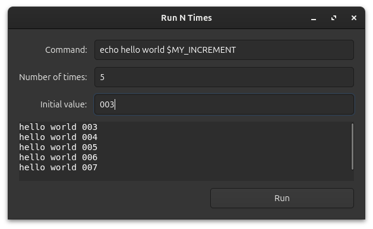

# Run N Times

A GTK4 application that allows you to run a command multiple times with an incrementing variable.



This project was developed by a lazy developer with the help of AI tools including ChatGPT, GitHub Copilot, and Cursor. It is a straightforward application consisting of a [Python file](run-n-times-gtk) for the GUI and a [Bash script](run-n-times). I think it's a nice base application which can serve as a starting point for building more advanced automation tools or learning about GTK4 and Flatpak packaging.

## Building and Installing with Flatpak

### Prerequisites

1. Install Flatpak and Flatpak Builder:
```bash
sudo apt install flatpak flatpak-builder
```

2. Add the Flathub repository:
```bash
flatpak remote-add --if-not-exists flathub https://dl.flathub.org/repo/flathub.flatpakrepo
```

3. Install the GNOME SDK:
```bash
flatpak install flathub org.gnome.Sdk//48 org.gnome.Platform//48
```

### Building the Flatpak

To build the Flatpak package, run:
```bash
flatpak-builder build-dir flatpak-manifest.json
```

### Installing the Flatpak

To install the built package:
```bash
flatpak-builder --user --install --force-clean build-dir flatpak-manifest.json
```

### Running the Application

After installation, you can run the application using:
```bash
flatpak run com.example.RunNTimes
```
